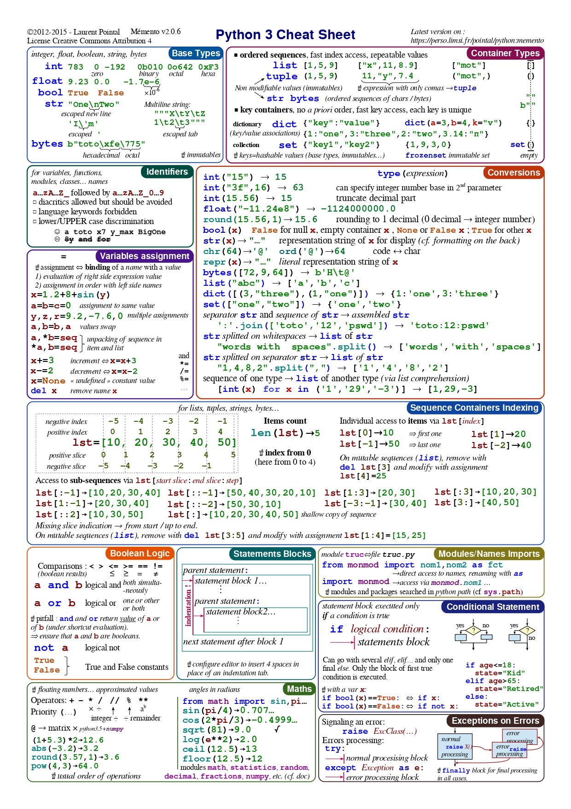
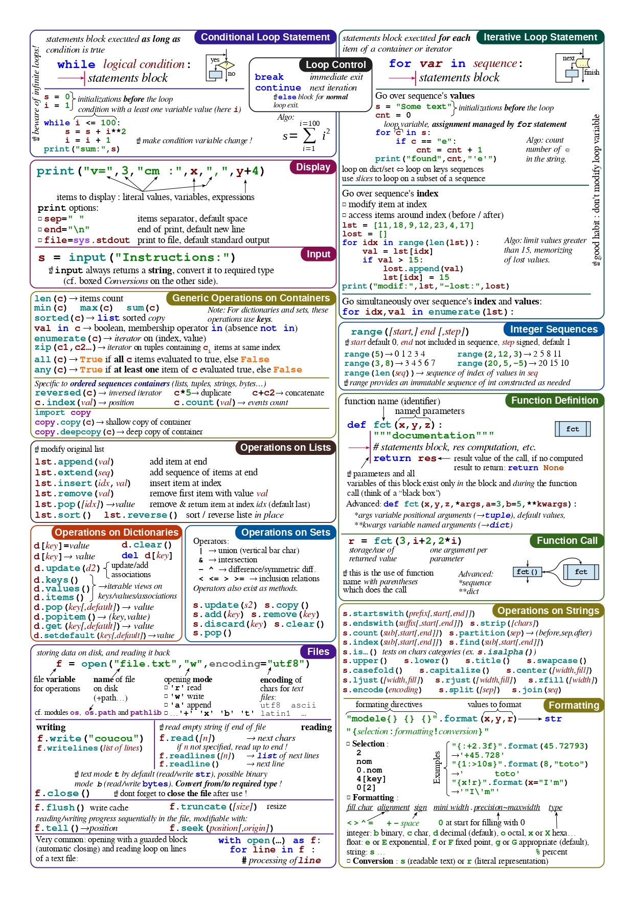

<!--more-->

##  What is a Cheatsheet?
Cheat sheet provide you with bare references for beginners and advanced developers,
along with lowering the entry barrier for newcomers and helping veterans refresh their old Python tricks.

##  Python
Python3 is a truly versatile programming language, loved both by web developers, data scientists
and software engineers. 

